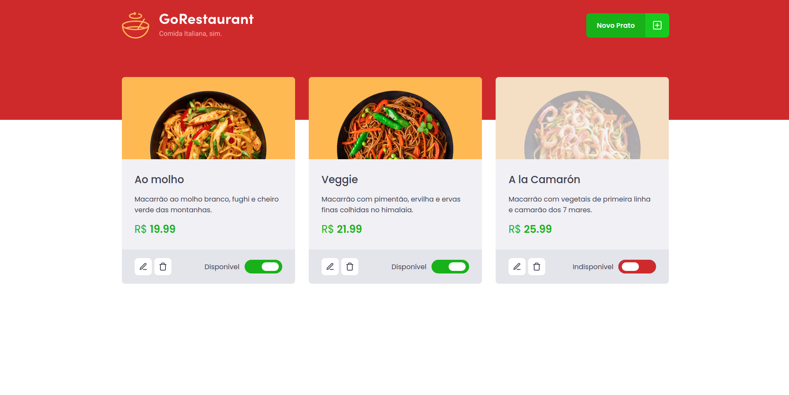

## GoRestauranteWeb

GoRestaurant is a fictional application in React.js that is an adm panel for restaurants to control which meals are available and which are unavailable.

## Preview

  

  

  

